<div align="center">
  <table border="0" cellpadding="20" cellspacing="0">
    <tr>
      <td align="center" valign="middle">
        
        <br/>
        <sub><b>ПГКПИ (VSCPI)</b><br/>Burgas, Bulgaria</sub>
      </td>
      <td align="center" valign="middle" style="font-size:2em; padding: 0 16px;">
        ×
      </td>
      <td align="center" valign="middle">
        
        <br/>
        <sub><b>Escola Secundária Dr. José Afonso (ESJA)</b><br/>Seixal, Portugal</sub>
      </td>
    </tr>
  </table>
</div>

# VSCPI Weather Station
### A Real-Time Atmospheric Monitoring System
**Erasmus+ Student Exchange Project**
*ПГКПИ (VSCPI), Burgas, Bulgaria × Escola Secundária Dr. José Afonso (ESJA), Seixal, Portugal*

---

> Built by two students from Bulgaria and two students from Portugal as part of the **Erasmus+ European Union Exchange Programme** - combining embedded hardware engineering, firmware development, real-time web dashboards, and relational database design into a complete, production-grade weather monitoring system.

---

<div align="center">

### Screenshots

<table border="0" cellpadding="8" cellspacing="0">
  <tr>
    <th align="center" width="50%">Web Dashboard</th>
    <th align="center" width="50%">iOS Mobile App</th>
  </tr>
  <tr>
    <td align="center">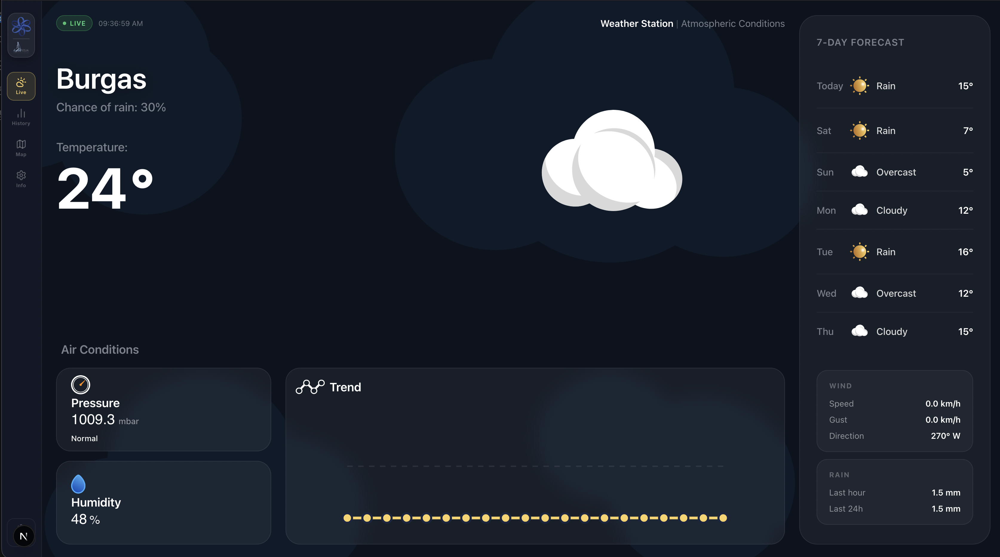<br/><sub>Live Dashboard</sub></td>
    <td align="center"><br/><sub>Live Dashboard</sub></td>
  </tr>
  <tr>
    <td align="center"><br/><sub>History</sub></td>
    <td align="center">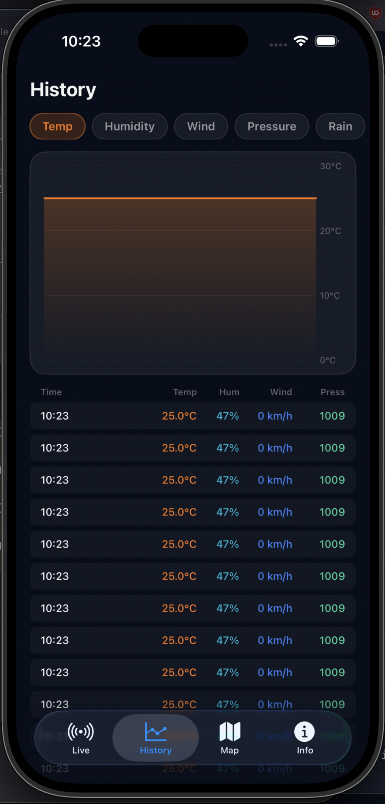<br/><sub>History</sub></td>
  </tr>
  <tr>
    <td align="center"><br/><sub>Map</sub></td>
    <td align="center">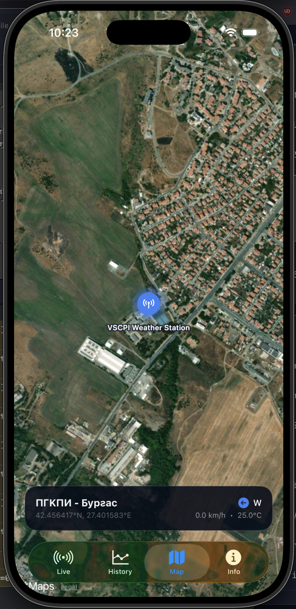<br/><sub>Map</sub></td>
  </tr>
  <tr>
    <td align="center">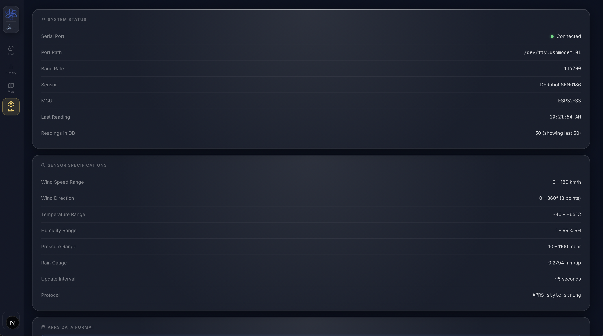<br/><sub>Info</sub></td>
    <td align="center">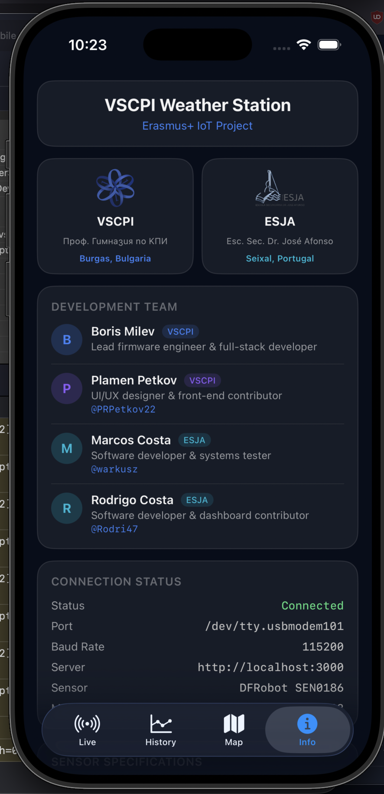<br/><sub>Info</sub></td>
  </tr>
</table>

</div>

---

## Table of Contents

1. [Project Overview](#1-project-overview)
2. [The Erasmus+ Programme & Schools](#2-the-erasmus-programme--schools)
3. [The Team](#3-the-team)
4. [System Architecture Overview](#4-system-architecture-overview)
5. [Hardware - Deep Dive](#5-hardware--deep-dive)
   - 5.1 [DFRobot SEN0186 Weather Station](#51-dfrobot-sen0186-weather-station)
   - 5.2 [SEN0186 Interface Board (Green PCB)](#52-sen0186-interface-board-green-pcb)
   - 5.3 [ESP32-S3-WROOM-1 Microcontroller](#53-esp32-s3-wroom-1-microcontroller)
   - 5.4 [12V DC Power Supply](#54-12v-dc-power-supply)
   - 5.5 [Bill of Materials](#55-bill-of-materials)
6. [Wiring - Complete Connection Guide](#6-wiring--complete-connection-guide)
   - 6.1 [Overview Diagram](#61-overview-diagram)
   - 6.2 [The Voltage Divider - Why It Is Critical](#62-the-voltage-divider--why-it-is-critical)
   - 6.3 [Step-by-Step Assembly](#63-step-by-step-assembly)
   - 6.4 [Safety Rules](#64-safety-rules)
7. [Firmware - ESP32-S3 (C++ / PlatformIO)](#7-firmware--esp32-s3-c--platformio)
   - 7.1 [APRS Serial Data Format](#71-aprs-serial-data-format)
   - 7.2 [Project Structure](#72-project-structure)
   - 7.3 [`platformio.ini` - Build Configuration](#73-platformioini--build-configuration)
   - 7.4 [`WeatherParser.h` - Data Structures & Interface](#74-weatherparserh--data-structures--interface)
   - 7.5 [`WeatherParser.cpp` - Parser Implementation](#75-weatherparsercpp--parser-implementation)
   - 7.6 [`main.cpp` - Entry Point](#76-maincpp--entry-point)
   - 7.7 [Unit Conversion Reference](#77-unit-conversion-reference)
   - 7.8 [Flashing the Firmware](#78-flashing-the-firmware)
8. [Weather Dashboard - Software Deep Dive](#8-weather-dashboard--software-deep-dive)
   - 8.1 [Technology Stack](#81-technology-stack)
   - 8.2 [Project File Structure](#82-project-file-structure)
   - 8.3 [Data Pipeline: Serial → SSE → Browser](#83-data-pipeline-serial--sse--browser)
   - 8.4 [API Routes](#84-api-routes)
   - 8.5 [Frontend Components](#85-frontend-components)
   - 8.6 [Database Schema](#86-database-schema)
   - 8.7 [Authentication & Admin Panel](#87-authentication--admin-panel)
   - 8.8 [External APIs](#88-external-apis)
   - 8.9 [CSS / Glassmorphism Design System](#89-css--glassmorphism-design-system)
9. [iOS Mobile App](#9-ios-mobile-app)
   - 9.1 [Overview & Tech Stack](#91-overview--tech-stack)
   - 9.2 [App Structure](#92-app-structure)
   - 9.3 [How It Connects to the Server](#93-how-it-connects-to-the-server)
10. [Data Flow - End to End](#10-data-flow--end-to-end)
11. [Setup & Running the Project](#11-setup--running-the-project)
    - 10.1 [Hardware Assembly](#101-hardware-assembly)
    - 10.2 [Firmware Setup (PlatformIO)](#102-firmware-setup-platformio)
    - 10.3 [Dashboard Setup (Next.js)](#103-dashboard-setup-nextjs)
    - 11.4 [Environment Variables](#114-environment-variables)
12. [Troubleshooting](#12-troubleshooting)

---

## 1. Project Overview

The **VSCPI Weather Station** is a complete, end-to-end atmospheric monitoring system built from scratch during the Erasmus+ student exchange visit. The project spans every layer of a modern IoT application:

| Layer | Technology | Purpose |
|-------|-----------|---------|
| **Physical Sensing** | DFRobot SEN0186 | Measures wind, rain, temperature, humidity, pressure |
| **Signal Processing** | SEN0186 Interface Board | Aggregates sensor signals, outputs APRS serial data |
| **Embedded Firmware** | ESP32-S3 + C++ / Arduino | Reads serial UART, parses APRS packets, USB-CDC output |
| **Real-Time Backend** | Next.js 16 + Node.js | Serial port singleton, SSE streaming, REST API |
| **Database** | MySQL 8 + Prisma ORM | Persistent storage of every reading, admin config |
| **Frontend Dashboard** | React 19 + TypeScript | Live display, 7-day forecast, history charts, map |
| **Authentication** | NextAuth v5 + bcrypt | Admin panel with JWT sessions |
| **iOS Mobile App** | SwiftUI (iOS 26) | Native iPhone app - live data, history charts, map, info |

The weather station sensor communicates via a proprietary APRS-style binary-encoded ASCII serial protocol. The custom firmware we wrote **parses this protocol in real time on the ESP32-S3**, converting raw integer fields into properly-scaled physical units (Celsius, m/s, mm of rain, mbar) and forwarding them over USB-CDC serial to the host computer. The Next.js server then reads the USB serial port, re-parses the data in TypeScript, saves it to MySQL, and pushes it to every connected browser using **Server-Sent Events (SSE)** - giving a live-updating dashboard with zero polling latency.

---

## 2. The Erasmus+ Programme & Schools

### About Erasmus+

**Erasmus+** is the European Union's programme for education, training, youth and sport. It enables students, teachers and schools across EU member states (and associated countries) to collaborate on projects, exchange knowledge and build cross-cultural professional skills. The programme funds student mobility, joint educational projects, and international partnerships.

This weather station project was conducted as part of an **Erasmus+ school exchange**, where students from Portugal visited VSCPI in Burgas, Bulgaria. The collaboration allowed each pair of students to contribute skills from their own national curriculum while learning from one another.

### ПГКПИ "Проф. д-р Асен Златаров" - Burgas, Bulgaria (VSCPI)

VSCPI (Професионална Гимназия по Компютърно Програмиране и Иновации - Professional High School of Computer Programming and Innovations) is a technical secondary school in Burgas, Bulgaria, located on the Black Sea coast. The school specialises in:

- **Software Development** - Python, C++, JavaScript, algorithms
- **Computer Systems** - networking, operating systems, embedded hardware
- **Database Design** - MySQL, PostgreSQL, data modelling
- **Web Technologies** - HTML/CSS/JS, React, Node.js

Burgas is the fourth-largest city in Bulgaria and a major port and industrial centre on the Black Sea. The school sits within the city and serves students aged 14–19 pursuing technical and computer science tracks.

### Escola Secundária Dr. José Afonso (ESJA) - Seixal, Portugal

**Escola Secundária Dr. José Afonso** (abbreviated ESJA) is the Portuguese partner school whose students participated in this Erasmus+ exchange visit to Burgas. The school is located in **Arrentela, Seixal**, in the Setúbal District - a municipality just south of Lisbon on the banks of the Tagus estuary, part of the greater Lisbon metropolitan area.

The school was founded in **1964** to serve the industrial Seixal region, originally as the Technical Industrial and Commercial School. It became autonomous in 1969 as the Escola Industrial e Comercial do Seixal, and following the unification of secondary education after the April 1974 Revolution, it was renamed the Escola Secundária do Seixal. In **1993**, it adopted its current name in honour of **Dr. José Afonso** - a celebrated teacher, poet, singer and anti-fascist resistance figure.

Today ESJA serves approximately **1,360 students** aged 12-18, staffed by 120 teachers and 37 school assistants. The school offers 3rd cycle and secondary education alongside **professional/vocational programmes** that equip students with practical skills for direct employment after graduation. The school has also participated in the **Eco-Escolas** programme since 2010-2011, earning the Green Flag environmental award every year through 2024-2025.

| Detail | Value |
|--------|-------|
| Full name | Escola Secundária Dr. José Afonso |
| Abbreviation | ESJA |
| Address | Avenida José Afonso, Arrentela, 2840-268 Seixal |
| District | Setúbal, Portugal |
| Founded | 1964 (current name since 1993) |
| Students | ~1,360 (ages 12-18) |
| Named after | Dr. José Afonso - teacher, poet, singer, resistance activist |

The Portuguese students brought their software expertise to the collaboration - Marcos contributed to the dashboard front-end, APRS parser validation and system testing, while Rodrigo contributed to dashboard development, database setup, admin panel testing and cross-browser validation.

### The Exchange

During the exchange, the four students worked together daily at VSCPI's laboratory, combining:

- **Boris Milev (VSCPI)** - firmware architecture, C++ APRS parser, Next.js backend, serial SSE pipeline, MySQL schema, Prisma ORM, NextAuth authentication, full React dashboard architecture
- **Plamen Petkov (VSCPI)** - UI/UX design, visual identity, glassmorphism design system, component layout, front-end implementation, icon design, animated transitions
- **Marcos Costa (ESJA)** - dashboard front-end contributions, TypeScript APRS parser validation, SSE pipeline debugging, end-to-end system testing, cross-browser QA
- **Rodrigo Costa (ESJA)** - History and Map tab contributions, database setup and verification, admin panel testing, UI feedback, cross-device QA

The result is the complete system documented here - a real, working weather station deployed on the VSCPI school premises.

---

## 3. The Team

**Bulgarian students (VSCPI, Burgas)**

- **Boris Milev** - Lead firmware engineer & full-stack developer. Designed the APRS parser (`WeatherParser.cpp/h`), the ESP32-S3 firmware (`main.cpp`), the Next.js serial API (`/api/serial/route.ts`), MySQL schema, Prisma ORM integration, NextAuth authentication, and the complete React dashboard architecture.

- **Plamen Petkov** ([@PRPetkov22](https://github.com/PRPetkov22)) - UI/UX designer & front-end contributor. Designed the visual identity and overall look and feel of the dashboard - the glassmorphism card system, colour palette, aurora animated background, and the layout of every screen. Responsible for the dashboard's component structure, icon design, responsive layout decisions, and the animated transitions between tabs. Contributed to the front-end implementation of the weather view, the forecast strip, and the information/settings panels.

**Portuguese students (ESJA, Seixal)**

- **Marcos Costa** ([@warkusz](https://github.com/warkusz)) - Software developer & systems tester. Contributed to the dashboard front-end, validated the TypeScript APRS parser against real sensor outputs, and helped debug the SSE data pipeline. Carried out end-to-end system testing of the full data pipeline from sensor output to browser display, stress-tested the dashboard across multiple browsers and devices, and documented software behaviour and edge cases throughout the build.

- **Rodrigo Costa** ([@Rodri47](https://github.com/Rodri47)) - Software developer & dashboard contributor. Contributed to the History tab layout and data table design, assisted with the Map tab integration, and helped set up and verify the MySQL database, seed data, and admin panel functionality. Provided detailed feedback on UI behaviour and usability throughout development, and assisted with cross-browser and cross-device QA testing.

---

## 4. System Architecture Overview

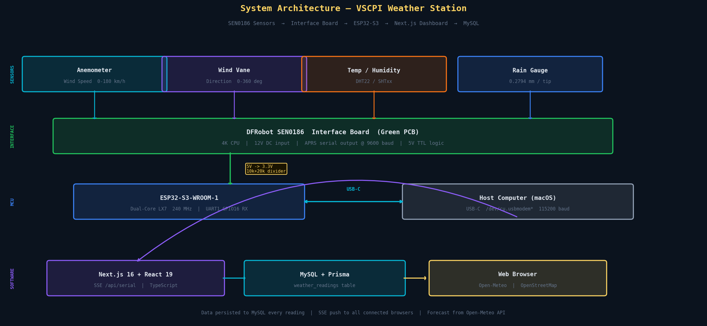

The system operates as a **4-layer pipeline**:

```
[Physical World]
  Wind, Rain, Temperature, Humidity, Barometric Pressure
        ↓  (mechanical / capacitive sensors)
[SEN0186 Interface Board]
  Aggregates all sensor signals
  Outputs APRS-style ASCII serial @ 9600 baud, 5V TTL
        ↓  (TX wire → 10kΩ+20kΩ voltage divider → GPIO 16)
[ESP32-S3 Firmware]
  UART1 receives APRS string
  WeatherParser extracts and converts all fields
  Prints parsed data to USB-CDC Serial @ 115200 baud
        ↓  (USB-C cable)
[Next.js Server - Host Computer]
  SerialPort reads USB-CDC stream
  TypeScript APRS parser mirrors the C++ one
  Writes to MySQL (Prisma ORM) - every single reading
  Broadcasts to all browser clients via SSE
        ↓  (HTTP Server-Sent Events)
[Web Browser]
  React 19 dashboard updates in real time
  AnimatedNumber Framer Motion springs on each value change
  7-day forecast pulled from Open-Meteo API
  Station location shown on OpenStreetMap embed
  History tab: sparkline charts + scrollable data table
```

Every component in this chain was built by the team from scratch - there is no off-the-shelf "weather station to web" middleware. We own the full stack, from the byte-level APRS parsing to the CSS glassmorphism card animations.

---

## 5. Hardware - Deep Dive

### 5.1 DFRobot SEN0186 Weather Station

The **DFRobot SEN0186** is a professional-grade outdoor weather station kit comprising three separate physical sensor units connected via RJ45-style cables to the interface board:

#### Anemometer (Wind Speed Sensor)
- **Measurement principle**: Rotating cup anemometer - 3 hemispherical cups mounted on a vertical axis. As wind forces the cups to rotate, a reed switch inside the housing closes once per revolution. The interface board counts switch closures per unit time and converts to wind speed.
- **Range**: 0 – 180 km/h (0 – 50 m/s)
- **Resolution**: Approximately 2.4 km/h per switch closure interval
- **Output**: Digital pulse via RJ45 cable → interface board

#### Wind Vane (Wind Direction Sensor)
- **Measurement principle**: A freely-rotating vane connected to a potentiometer or resistor network. The orientation of the vane determines which internal resistors are selected, producing a discrete set of voltages corresponding to the 8 (or 16) cardinal directions.
- **Range**: 0° – 360° (8 primary points: N, NE, E, SE, S, SW, W, NW)
- **Output**: Analogue voltage → interface board ADC → APRS `c` field

#### Rain Gauge (Tipping Bucket)
- **Measurement principle**: A funnel collects rainfall into a small bucket. When the bucket fills to exactly **0.2794 mm** of accumulated rainfall, it tips over, empties, and triggers a magnetic reed switch. The interface board counts these tips.
- **Resolution**: 0.2794 mm per tip (displayed as 0.01-inch units in APRS)
- **Output**: Digital pulse per tip → interface board counter
- **Known issue**: When the rain gauge is not connected or reports an error, the interface board outputs `453` in the `r` and `p` fields. Our parser detects this and sets `rainfallValid = false`.

#### Temperature / Humidity Sensor
- **Sensor type**: Plugged into the interface board's dedicated port - compatible with DHT11, DHT22, AM2320, SHTxx family
- **Temperature range**: −40°C to +65°C
- **Humidity range**: 1% – 99% RH (non-condensing)
- **Output**: Digital 1-wire or I²C protocol → interface board → APRS `t` and `h` fields

#### Barometric Pressure Sensor
- **Sensor type**: BMP180 or equivalent, plugged into the interface board's pressure port
- **Range**: 300 – 1100 hPa (mbar)
- **Resolution**: 0.01 hPa
- **Output**: I²C → interface board → APRS `b` field (in 0.1 mbar units)

---

### 5.2 SEN0186 Interface Board (Green PCB)

The green PCB is the heart of the physical layer. It is a dedicated **signal aggregation and serial conversion board** - a small embedded computer in its own right.

#### Specifications
| Parameter | Value |
|-----------|-------|
| Processor | 4K CPU (proprietary microcontroller) |
| Input voltage | 5V – 12V DC (12V recommended for full sensor power) |
| Power connector | 3-pin orange screw terminal (VIN / DATA / GND) |
| Sensor connectors | 2x RJ45 sockets (wind speed+direction, rain gauge) |
| Expansion ports | DHT temperature/humidity port, BMP pressure port |
| Serial output | UART TTL, **9600 baud** (configurable via jumper to 2400) |
| Serial logic level | **5V TTL** - IMPORTANT, see voltage divider section |
| Output format | APRS-style ASCII string, one per second |
| Serial connector | 4-pin header: 5V / RX / TX / GND |

#### What the Interface Board Does
1. **Reads the anemometer** - counts reed switch pulses, computes 1-minute average wind speed in mph
2. **Reads the wind vane** - samples the ADC, maps voltage to compass direction
3. **Reads the rain gauge** - counts bucket tips, maintains 1-hour and 24-hour cumulative totals
4. **Reads temperature/humidity** - queries the DHT/SHT sensor
5. **Reads barometric pressure** - queries the BMP sensor via I²C
6. **Assembles the APRS packet** - formats all values into the standardised string
7. **Transmits via UART** - outputs the complete string once per second at 9600 baud, 8N1

#### The Baud Rate Jumper
The interface board has a physical jumper that switches output speed between **9600 baud** (default) and **2400 baud**. Our firmware is set to **9600 baud**. If you get garbage data, verify the jumper position matches your `WEATHER_BAUD` constant in `main.cpp`.

---

### 5.3 ESP32-S3-WROOM-1 Microcontroller

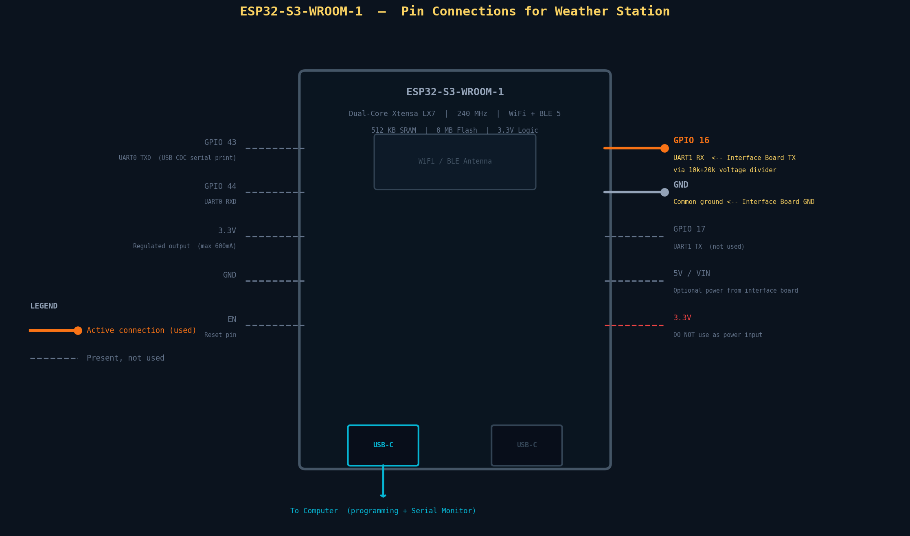

The **ESP32-S3-WROOM-1** is Espressif's latest-generation dual-core microcontroller with integrated Wi-Fi and Bluetooth, used here as the bridge between the weather station hardware and the host computer.

#### Full Specifications
| Parameter | Value |
|-----------|-------|
| **CPU** | Dual-core Xtensa LX7, up to **240 MHz** |
| **SRAM** | 512 KB internal SRAM |
| **Flash** | 8 MB QSPI Flash |
| **ROM** | 384 KB |
| **Wi-Fi** | 802.11 b/g/n, 2.4 GHz |
| **Bluetooth** | BT 5.0 (LE), BLE Mesh |
| **UART ports** | UART0, UART1, UART2 (any GPIO via GPIO matrix) |
| **ADC** | Two 12-bit SAR ADCs (20 channels total) |
| **I²C** | 2x I²C controllers |
| **SPI** | 4x SPI controllers |
| **USB** | Native USB 1.1 OTG (Full Speed) |
| **Logic level** | **3.3V - GPIO pins are NOT 5V tolerant** |
| **Operating voltage** | 3.0V – 3.6V (power via USB-C or VIN pin) |
| **USB-C ports** | 2x - Bottom-left: Native CDC/JTAG, Bottom-right: CH343 UART bridge |
| **GPIO count** | 45 programmable GPIOs |

#### Why the ESP32-S3-WROOM-1?
- **Native USB CDC** - The ESP32-S3 has a hardware USB controller. When `ARDUINO_USB_CDC_ON_BOOT=1` is set, `Serial.print()` output appears directly on the USB port as a standard CDC serial device - no USB-to-UART chip required. This means the Next.js server can open `/dev/cu.usbmodem*` and read the parsed weather data at 115200 baud.
- **Two independent UARTs** - UART1 (GPIO 16) receives data from the weather station at 9600 baud, while USB-CDC transmits parsed data to the computer at 115200 baud. These are completely independent with no shared resources.
- **Dual-core processing** - UART reception is handled by the hardware peripheral with hardware FIFOs, so even a single-core loop handles the task with ease at these baud rates.

#### Pin Usage in This Project

| GPIO | Function | Direction | Connected To |
|------|----------|-----------|--------------|
| **GPIO 16** | UART1 RX | INPUT | Interface Board TX (via 10kΩ+20kΩ divider) |
| **GPIO 17** | UART1 TX | OUTPUT | Not connected (reserved) |
| **GND** | Common ground | - | Interface Board GND |
| **USB-C (bottom-left)** | Native CDC | Bidirectional | Host Computer USB-C |

---

### 5.4 12V DC Power Supply

The interface board requires a **12V DC supply at minimum 1A**. This powers:
- The interface board's internal logic
- The SEN0186 sensor subsystems (wind/rain)
- The temperature and pressure sensors

The ESP32-S3 is powered **separately** via its USB-C connection to the host computer - this provides clean 5V regulation and keeps the debug/programming path independent of the sensor power rail.

**Do not** power both the interface board and the ESP32 from the same USB port or single supply without carefully checking the current budget.

---

### 5.5 Bill of Materials

| Component | Quantity | Notes |
|-----------|----------|-------|
| DFRobot SEN0186 Weather Station | 1 | Includes anemometer, wind vane, rain gauge |
| SEN0186 Interface Board (Green PCB) | 1 | Included with SEN0186 |
| ESP32-S3-DevKitC-1 (WROOM-1 module) | 1 | Any revision works |
| 12V DC Power Supply (≥1A) | 1 | Centre-positive barrel jack |
| 10kΩ resistor (1/4W) | 1 | For voltage divider R1 |
| 20kΩ resistor (1/4W) | 1 | For voltage divider R2 |
| Jumper wires (F-F or M-F) | 4+ | For interface board → ESP32 connections |
| USB-C data cable | 1 | Data + power capable (not charge-only) |
| Breadboard (optional) | 1 | For voltage divider circuit |

**Total additional cost** (assuming ESP32 and weather station already owned): approximately €5–15 for resistors, wires, and supply.

---

## 6. Wiring - Complete Connection Guide

### 6.1 Overview Diagram

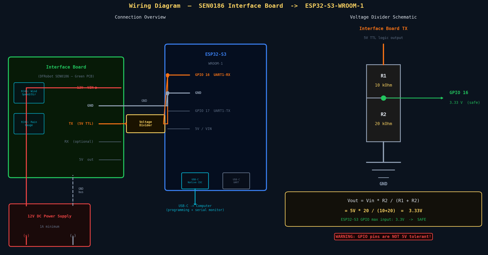

The complete wiring involves three power domains and two data paths:

```
12V DC Supply ─────────────────────────────── Interface Board VIN
                                              Interface Board GND ─── Common GND ─── ESP32 GND
Interface Board TX (5V) ─── R1(10kΩ) ─── ┬ ─── R2(20kΩ) ─── GND
                                           │
                                           └─── GPIO 16 (3.33V - safe for ESP32-S3)
ESP32 USB-C ──────────────────────────────── Host Computer USB-C
```

### 6.2 The Voltage Divider - Why It Is Critical


This is the **single most important electrical detail** of the entire hardware build. Get it wrong and you will permanently damage the ESP32-S3.

#### The Problem

The SEN0186 interface board's TX pin outputs **5V TTL logic**:
- Logic HIGH = 5.0V
- Logic LOW = 0V

The ESP32-S3-WROOM-1 GPIO pins are rated at **3.3V maximum**:
- Maximum safe input voltage on any GPIO: **3.3V**
- The ESP32-S3 datasheet explicitly states that GPIO pins are **not 5V-tolerant**

Applying 5V directly to GPIO 16 will cause:
- Immediate risk: GPIO latch-up or destruction
- Long-term risk: Gradual oxide breakdown of the input protection diodes
- System-level risk: If the input protection diode conducts, it can back-power the 3.3V supply rail and damage the LDO regulator

#### The Solution: Resistor Voltage Divider

We add two resistors between the interface board TX pin and GPIO 16:

```
Interface Board TX (5V)
        │
       [R1 = 10kΩ]
        │
        ├──────── GPIO 16  ← This node sits at 3.33V
        │
       [R2 = 20kΩ]
        │
       GND
```

**Calculation:**

```
Vout = Vin × R2 / (R1 + R2)
     = 5V  × 20,000 / (10,000 + 20,000)
     = 5V  × 20 / 30
     = 5V  × 0.6667
     = 3.333V  ✓  (safe for ESP32-S3)
```

The 3.333V output is well within the 3.3V + 10% tolerance that the ESP32-S3 input buffers can handle, and it is cleanly above the `VIH` (minimum voltage recognised as logic HIGH) threshold of approximately 2.31V for 3.3V logic.

**Why these specific resistor values?**
- The total resistance (30kΩ) is high enough to limit current draw from the interface board TX to < 0.2mA - far below what the interface board driver can source
- The ratio 1:2 gives exactly the 2/3 scaling factor we need
- Both values are extremely common standard values (E12 / E24 series) available at any electronics shop

**Impedance note:** The ESP32-S3 GPIO input impedance is very high (> 1MΩ) when configured as a digital input, so the GPIO draws negligible current through the divider. The Thevenin equivalent source impedance at the mid-point is R1 ∥ R2 = 10k ∥ 20k ≈ 6.67kΩ, which is fine for UART speeds up to well beyond 9600 baud.

---

### 6.3 Step-by-Step Assembly

**Step 1 - Connect the sensors to the interface board**

Plug the RJ45 connectors from the SEN0186 sensor head into the interface board:
- Top white RJ45 socket → wind speed / direction cable
- Bottom white RJ45 socket → rain gauge cable

Plug the temperature/humidity sensor into its dedicated 3-pin port on the board (marked with a thermometer icon or "T/H").

Plug the BMP barometric pressure sensor into its I²C port (marked "P" or "BMP").

**Step 2 - Wire the voltage divider**

Using the breadboard or connecting directly:
1. Connect Interface Board **TX** to one leg of R1 (10kΩ)
2. Connect the other leg of R1 to the junction node (and to one leg of R2 and to ESP32 **GPIO 16**)
3. Connect the other leg of R2 to **GND**

**Step 3 - Connect Interface Board GND to ESP32 GND**

This is mandatory. Without a common ground reference, the UART signal levels are undefined. Use a short, direct wire - do not rely on the power supply as the only ground path.

**Step 4 - Power the interface board**

Connect the 12V DC supply to the orange terminal block on the interface board:
- Red wire (+) → VIN terminal (top screw)
- Black wire (−) → GND terminal (bottom screw)

Double-check polarity before applying power. Reverse polarity will destroy the board.

**Step 5 - Connect ESP32-S3 to the host computer**

Connect a USB-C data cable (not a charge-only cable) from the ESP32-S3's **bottom-left USB-C port** (Native CDC) to the host computer's USB-A or USB-C port.

**Step 6 - Verify before powering on**

- [ ] Interface board TX → voltage divider R1 → midpoint → GPIO 16
- [ ] Voltage divider midpoint → R2 → GND
- [ ] Interface board GND → ESP32 GND (direct wire)
- [ ] 12V supply connected to VIN/GND terminal on interface board
- [ ] Polarity correct on 12V supply
- [ ] USB-C cable connected to ESP32 bottom-left port
- [ ] No bare wires touching each other

---

### 6.4 Safety Rules

| Rule | Reason |
|------|--------|
| Always use the voltage divider on TX | ESP32-S3 GPIO is 3.3V max. 5V will destroy it |
| Never connect 12V to ESP32 VIN | ESP32-S3 VIN is rated 5V max via USB or 5V pin |
| Always connect GND before signal wires | Prevents ground bounce and latch-up on power-on |
| Use only data-capable USB-C cables | Charge-only cables have no D+/D− lines; the ESP32 won't enumerate |
| Disconnect power before changing wiring | Prevents short circuits during assembly |
| Keep interface board and ESP32 enclosures dry | The sensors are outdoor-rated; the electronics are not |

---

## 7. Firmware - ESP32-S3 (C++ / PlatformIO)

### 7.1 APRS Serial Data Format

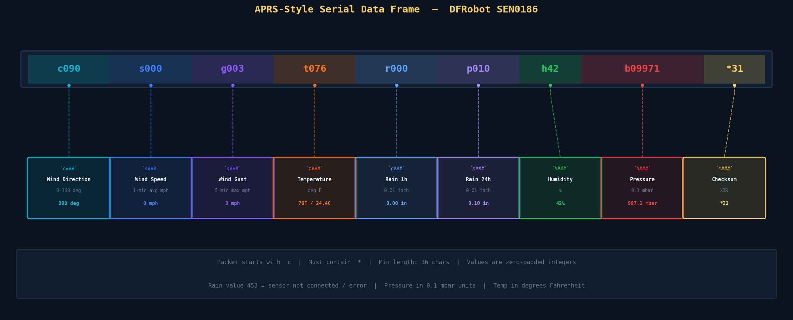

The SEN0186 interface board outputs a single ASCII string once per second over its UART TX pin. The format is based on the **APRS (Automatic Packet Reporting System)** weather data standard - a protocol used by amateur radio operators to broadcast real-time weather data over the air. The interface board reuses this compact, human-readable format for its serial output.

#### Example Packet

```
c090s000g003t076r000p010h42b09971*31
```

#### Field Breakdown

| Field | Characters | Start Index | Length | Meaning | Units | Parsed Example |
|-------|-----------|-------------|--------|---------|-------|----------------|
| `c` | 0 | 1 | 3 | Wind direction | 0–360° | `090` → East |
| `s` | 4 | 5 | 3 | Wind speed (1-min avg) | mph | `000` → 0 mph |
| `g` | 8 | 9 | 3 | Wind gust (5-min max) | mph | `003` → 3 mph |
| `t` | 12 | 13 | 3 | Temperature | °F | `076` → 76°F = 24.4°C |
| `r` | 16 | 17 | 3 | Rainfall last 1 hour | 0.01 inches | `000` → 0.00 in |
| `p` | 20 | 21 | 3 | Rainfall last 24 hours | 0.01 inches | `010` → 0.10 in |
| `h` | 24 | 25 | 2 | Relative humidity | % | `42` → 42% |
| `b` | 27 | 28 | 5 | Barometric pressure | 0.1 mbar | `09971` → 997.1 mbar |
| `*` | 33 | 34 | 2 | XOR checksum | hex | `31` |

#### Key Protocol Details

1. **Packet always starts with `c`** - the parser validates `data.charAt(0) == 'c'`
2. **Must contain `*`** - used to locate the checksum position
3. **Minimum valid length: 36 characters** - shorter packets are rejected
4. **Values are zero-padded integers** - e.g. wind direction `090` not `90`
5. **Rain gauge error sentinel: `453`** - when the rain gauge is disconnected or malfunctioning, the interface board outputs `453` in both rain fields. Our parser detects this, sets `rainfallValid = false`, and zeroes all rainfall values rather than displaying nonsense.
6. **Humidity uses 2-digit field** - `h42` not `h042` - starts at index 24 with length 2
7. **Pressure uses 5-digit field** - `b09971` starts at index 27 (the `b`) with data at 28, length 5

#### Checksum Algorithm (XOR)

The checksum is the XOR of all bytes between (not including) `c` and `*`:

```
XOR of: 0, 9, 0, s, 0, 0, 0, g, 0, 0, 3, t, 0, 7, 6, r, 0, 0, 0, p, 0, 1, 0, h, 4, 2, b, 0, 9, 9, 7, 1
Result → 0x31
```

> **Note:** The checksum is currently not validated by the parser (`validateChecksum()` returns `true` always - listed as TODO). The string structure validation (starts with `c`, contains `*`, minimum length) is sufficient for our hardware setup where signal integrity is guaranteed by the resistor divider.

---

### 7.2 Project Structure

```
SN0186-VSCPI-Firmware/
├── platformio.ini          ← Build configuration (board, framework, flags)
└── src/
    ├── main.cpp            ← Entry point: UART setup, read loop, print loop
    ├── WeatherParser.h     ← WeatherData struct + WeatherParser class declaration
    └── WeatherParser.cpp   ← Full parser implementation + unit conversions
```

---

### 7.3 `platformio.ini` - Build Configuration

```ini
[env:esp32-s3-devkitc-1]
platform = espressif32
board = esp32-s3-devkitc-1
framework = arduino
monitor_speed = 115200
upload_speed = 921600

build_flags =
    -DARDUINO_USB_MODE=1
    -DARDUINO_USB_CDC_ON_BOOT=1
```

#### Flag Explanations

| Flag | Purpose |
|------|---------|
| `platform = espressif32` | Selects Espressif's PlatformIO platform package, which includes the ESP-IDF toolchain and Arduino core for ESP32-S3 |
| `board = esp32-s3-devkitc-1` | Selects the board JSON that defines the ESP32-S3-DevKitC-1 memory layout, flash size, and pin defaults |
| `framework = arduino` | Uses the Arduino abstraction layer (HardwareSerial, Serial, delay, etc.) on top of ESP-IDF |
| `monitor_speed = 115200` | Sets the baud rate for `pio device monitor` - must match `Serial.begin(115200)` in code |
| `upload_speed = 921600` | Uses the fastest reliable upload baud rate - uploads a ~300KB binary in ~3 seconds |
| `-DARDUINO_USB_MODE=1` | Enables native USB mode - the USB controller is routed through the Arduino USB stack |
| `-DARDUINO_USB_CDC_ON_BOOT=1` | **Critical flag** - makes `Serial` (the default `Serial` object in Arduino) output over native USB-CDC instead of UART0. Without this, `Serial.print()` goes to the UART0 pins (GPIO 43/44) and nothing appears on the USB-CDC port |

---

### 7.4 `WeatherParser.h` - Data Structures & Interface

```cpp
struct WeatherData {
  // Raw values (as received - direct integer extraction from APRS string)
  int windDirection;  // 0–360 degrees
  int windSpeedAvg;   // mph (1-minute average)
  int windGust;       // mph (5-minute maximum)
  int temperature;    // Fahrenheit (raw integer)
  int rainfall1h;     // 0.01-inch units (last hour)
  int rainfall24h;    // 0.01-inch units (last 24h)
  int humidity;       // percentage (0–100)
  int pressure;       // 0.1-mbar units

  // Converted values (ready to display - all floating point)
  float tempF;            // °F
  float tempC;            // °C
  float windSpeedMPH;     // mph
  float windSpeedMS;      // m/s
  float windGustMPH;      // mph
  float windGustMS;       // m/s
  float rainfallInch1h;   // inches (last hour)
  float rainfallMM1h;     // millimetres (last hour)
  float rainfallInch24h;  // inches (last 24h)
  float rainfallMM24h;    // millimetres (last 24h)
  float humidityPercent;  // %
  float pressureMbar;     // mbar
  float pressureInHg;     // inches of mercury

  // Status
  bool isValid;        // false if packet fails basic validation checks
  bool rainfallValid;  // false if 453 error code detected in rain fields
  String checksum;     // checksum string extracted from packet
};
```

#### Design Decisions

**Dual-representation**: Every measurement is stored in both its raw integer form and one or more converted float forms. The raw integers allow byte-for-byte logging and debugging. The converted floats are used directly for display without any additional computation in `main.cpp`.

**Status flags**: Rather than throwing an exception or returning null (which Arduino C++ doesn't support naturally), the struct carries validity flags. `isValid = false` means the entire packet was malformed and nothing should be trusted. `rainfallValid = false` means the rest of the data is fine but the rain sensor is disconnected.

**`String checksum`**: Arduino's `String` type is used here rather than `char[]` for simplicity in a non-performance-critical context. The checksum is only used for display and future validation.

---

### 7.5 `WeatherParser.cpp` - Parser Implementation

#### `extractInt()` - Safe Substring to Integer

```cpp
int WeatherParser::extractInt(String data, int start, int length) {
  if (start + length > data.length()) {
    return -1;
  }
  String substr = data.substring(start, start + length);
  return substr.toInt();
}
```

This helper is called for every field. It performs a bounds check before calling `substring()` to prevent undefined behaviour if the packet is shorter than expected (e.g. if a partial packet arrived due to a UART buffer flush). Returning `-1` on out-of-bounds allows calling code to detect the error via the `isValid` flag rather than reading garbage memory.

#### `parse()` - Main Parser

The `parse()` function is a single-pass, fixed-offset parser. Because the APRS format is completely fixed-width (every field at a known character position), there is no need for a tokeniser or regular expression - we simply index directly into the string:

```cpp
// Wind direction: characters at index 1, 2, 3 (after the 'c')
weather.windDirection = extractInt(data, 1, 3);

// Wind speed: characters at index 5, 6, 7 (after the 's')
weather.windSpeedAvg = extractInt(data, 5, 3);

// Wind gust: characters at index 9, 10, 11 (after the 'g')
weather.windGust = extractInt(data, 9, 3);

// Temperature: characters at index 13, 14, 15 (after the 't')
weather.temperature = extractInt(data, 13, 3);

// Rainfall 1h: characters at index 17, 18, 19 (after the 'r')
weather.rainfall1h = extractInt(data, 17, 3);

// Rainfall 24h: characters at index 21, 22, 23 (after the 'p')
weather.rainfall24h = extractInt(data, 21, 3);

// Humidity: characters at index 25, 26 (after the 'h') - 2 digits only!
weather.humidity = extractInt(data, 25, 2);

// Pressure: characters at index 28, 29, 30, 31, 32 (after 'b') - 5 digits
weather.pressure = extractInt(data, 28, 5);
```

**Validation gates** (both must pass for `isValid = true`):
1. `data.length() >= 36` - minimum packet length
2. `data.charAt(0) == 'c'` - correct packet start
3. `data.indexOf('*') != -1` - checksum delimiter present

**Rain gauge error handling:**
```cpp
if (weather.rainfall1h == 453 || weather.rainfall24h == 453) {
    weather.rainfallValid = false;
    weather.rainfallInch1h = 0;
    weather.rainfallMM1h   = 0;
    weather.rainfallInch24h = 0;
    weather.rainfallMM24h   = 0;
}
```
The value `453` is a sentinel defined by DFRobot's interface board firmware. It does not represent real rainfall - it indicates the rain gauge is not properly connected or is experiencing a fault.

#### `printData()` - Formatted Serial Output

The `printData()` method outputs a neatly formatted, Unicode-boxed display to the serial monitor:

```
╔════════════════════════════════════════╗
║        WEATHER STATION DATA            ║
╠════════════════════════════════════════╣
║ 🌡️  Temperature:  76.0°F / 24.4°C
║ 💧 Humidity:      42%
║ 🔽 Pressure:      997.1 mbar / 29.44 inHg
║ 🧭 Wind Dir:      90° (E)
║ 💨 Wind Speed:    0.0 mph / 0.0 m/s
║ 🌪️  Wind Gust:     3.0 mph / 1.3 m/s
║ ☔ Rain (1h):     0.00" / 0.0 mm
║ ☔ Rain (24h):    0.10" / 2.5 mm
║ 📝 Checksum:     *31
╚════════════════════════════════════════╝
```

The **wind direction** is converted from degrees to a compass label by dividing the 360° circle into 45° sectors:

| Range | Label | Range | Label |
|-------|-------|-------|-------|
| 0–22° | N | 180–202° | S |
| 23–67° | NE | 203–247° | SW |
| 68–112° | E | 248–292° | W |
| 113–157° | SE | 293–337° | NW |
| 338–360° | N | - | - |

---

### 7.6 `main.cpp` - Entry Point

```cpp
#define WEATHER_RX_PIN 16   // GPIO 16 - connect via voltage divider!
#define WEATHER_TX_PIN 17   // Not used
#define WEATHER_BAUD   9600 // Interface board default baud rate

HardwareSerial WeatherSerial(1); // UART1 - independent from USB-CDC Serial
```

#### `setup()`

```cpp
void setup() {
  Serial.begin(115200);          // USB-CDC serial to computer @ 115200
  delay(2000);                   // Wait for USB enumeration on host

  WeatherSerial.begin(            // Open UART1
    WEATHER_BAUD,                 // 9600 baud
    SERIAL_8N1,                   // 8 data bits, no parity, 1 stop bit
    WEATHER_RX_PIN,               // RX = GPIO 16
    WEATHER_TX_PIN                // TX = GPIO 17 (not connected)
  );
}
```

The 2-second `delay()` after `Serial.begin()` is important: it gives the host operating system time to enumerate the USB-CDC device and assign it a port name (e.g. `/dev/cu.usbmodem1101` on macOS). Without this delay, the first `Serial.println()` calls may be lost before the host is ready to receive.

`HardwareSerial WeatherSerial(1)` explicitly selects **UART1** hardware. UART0 (`HardwareSerial WeatherSerial(0)`) is internally used by `Serial` when `ARDUINO_USB_CDC_ON_BOOT=0`, but with our build flags, `Serial` is mapped to USB-CDC and UART0 is free. Using UART1 makes the architecture clear and unambiguous.

`SERIAL_8N1` is the universal UART framing setting:
- **8** data bits per character
- **N** - No parity bit
- **1** stop bit

This matches the interface board's fixed output framing.

#### `loop()`

```cpp
void loop() {
  if (WeatherSerial.available()) {
    String data = WeatherSerial.readStringUntil('\n');
    data.trim();

    if (data.length() > 0) {
      Serial.print("[RAW] ");
      Serial.println(data);

      WeatherData weather = WeatherParser::parse(data);
      WeatherParser::printData(weather);
    }
  }

  delay(100);
}
```

`readStringUntil('\n')` blocks until a newline character is received or a timeout occurs. The interface board terminates each packet with `\r\n` (CRLF). The subsequent `.trim()` removes any trailing `\r` or whitespace.

The `[RAW]` prefix on the raw string output is intentionally parseable by the Next.js serial reader - see `app/api/serial/route.ts` which strips this prefix: `data.substring(5).trim()`.

The `delay(100)` at the end of the loop is a deliberate 100ms yield. Since the interface board only sends one packet per second, polling every 100ms is more than sufficient. This also prevents the watchdog timer from triggering and gives the ESP32's background tasks (USB CDC, Wi-Fi stack) time to run.

---

### 7.7 Unit Conversion Reference

| Raw Unit | Multiply by | Result |
|----------|-------------|--------|
| mph | × 0.44704 | m/s |
| mph | × 1.60934 | km/h |
| 0.01 inches (rain) | × 0.01 | inches |
| inches | × 25.4 | millimetres |
| °F | (F − 32) × 5/9 | °C |
| 0.1 mbar | ÷ 10 | mbar |
| mbar | × 0.02953 | inches of mercury (inHg) |

These conversions are implemented in `WeatherParser.cpp` and mirrored identically in the TypeScript parser at `app/api/serial/route.ts`.

---

### 7.8 Flashing the Firmware

**Prerequisites:**
- [VSCode](https://code.visualstudio.com/) with [PlatformIO IDE extension](https://platformio.org/install/ide?install=vscode)
- Or [PlatformIO Core CLI](https://docs.platformio.org/page/core/installation.html)

**Steps:**

```bash
# Clone or navigate to the firmware folder
cd SN0186-VSCPI-Firmware

# Build the firmware
pio run

# Flash to the connected ESP32-S3
pio run --target upload

# Open serial monitor
pio device monitor
```

If the ESP32-S3 does not enter flash mode automatically:
1. Hold the **BOOT** button on the DevKit board
2. Press and release **RESET**
3. Release **BOOT**
4. Run `pio run --target upload`

The upload speed is set to 921600 baud which completes a full flash in approximately 3–4 seconds. After flashing, the board resets automatically and `pio device monitor` should show the weather station banner followed by incoming data packets.

---

## 8. Weather Dashboard - Software Deep Dive

### 8.1 Technology Stack

| Technology | Version | Role |
|-----------|---------|------|
| **Next.js** | 16.1.6 | Full-stack framework (App Router) |
| **React** | 19.2.3 | UI library |
| **TypeScript** | 5.x | Type safety throughout |
| **Prisma** | 5.22.0 | ORM - type-safe MySQL queries |
| **MySQL** | 8.x | Relational database |
| **mysql2** | 3.17.2 | Low-level MySQL driver (used by Prisma) |
| **serialport** | 13.0.0 | Node.js native USB serial communication |
| **next-auth** | 5.0.0-beta | Authentication (JWT sessions) |
| **bcryptjs** | 3.0.3 | Password hashing (Blowfish cipher) |
| **framer-motion** | 12.34.1 | Animated number springs, page transitions |
| **lucide-react** | 0.574.0 | Icon library (SVG icons) |
| **Tailwind CSS** | 4.x | Utility CSS (used minimally; most styling is inline) |

---

### 8.2 Project File Structure

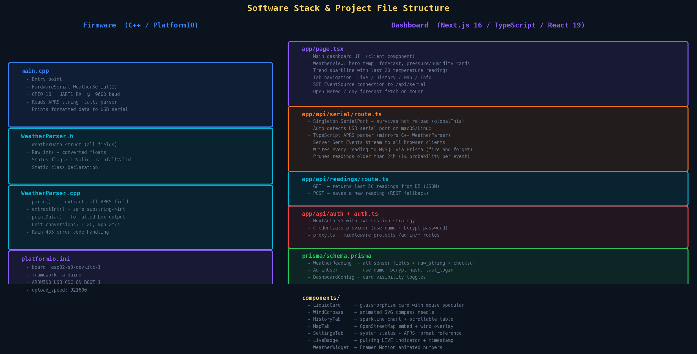

```
weather-dashboard/
├── app/
│   ├── layout.tsx                    ← Root layout: aurora background, SVG liquid glass filter
│   ├── page.tsx                      ← Main dashboard page (Live / History / Map / Info tabs)
│   ├── globals.css                   ← Global CSS: glassmorphism, aurora animations, live badge
│   ├── favicon.ico
│   └── api/
│       ├── serial/
│       │   └── route.ts              ← SerialPort singleton + APRS parser + SSE stream
│       ├── readings/
│       │   └── route.ts              ← GET last 50 readings / POST new reading
│       ├── config/
│       │   └── route.ts              ← GET dashboard card config (public)
│       ├── auth/
│       │   └── [...nextauth]/
│       │       └── route.ts          ← NextAuth.js handler
│       └── admin/
│           └── config/
│               └── route.ts          ← PUT dashboard config (admin only)
│
├── components/
│   ├── WeatherWidget.tsx             ← AnimatedNumber (Framer Motion spring)
│   ├── WindCompass.tsx               ← SVG animated compass needle
│   ├── LiquidCard.tsx                ← Glassmorphism card with mouse specular highlight
│   ├── LiveBadge.tsx                 ← Pulsing LIVE indicator + last update timestamp
│   ├── HistoryTab.tsx                ← SVG sparkline chart + scrollable data table
│   ├── MapTab.tsx                    ← OpenStreetMap embed + wind direction overlay
│   ├── SettingsTab.tsx               ← System status display + APRS format reference
│   └── icons/
│       ├── SunIcon.tsx
│       ├── DarkCloudIcon.tsx
│       ├── CloudIcons.tsx            ← CloudRightSun, CloudLeftCity, CloudBottomLeft/Right
│       ├── HumidityIcon.tsx
│       ├── PressureIcon.tsx
│       ├── TrendIcon.tsx
│       └── ForecastIcons.tsx         ← Sunny/Cloudy/Rainy/Storm/Snow/SunnyCloudy icons
│
├── lib/
│   └── prisma.ts                     ← Prisma client singleton (prevents connection flooding in dev)
│
├── prisma/
│   └── schema.prisma                 ← Database schema: WeatherReading, AdminUser, DashboardConfig
│
├── auth.ts                           ← NextAuth configuration (credentials provider + bcrypt)
├── proxy.ts                          ← Next.js middleware: protects /admin/* routes
├── schema.sql                        ← Raw SQL for manual DB creation
├── next.config.ts                    ← serverExternalPackages, allowedDevOrigins
├── package.json
├── tsconfig.json
└── .env                              ← DATABASE_URL, NEXTAUTH_SECRET, SERIAL_BAUD
```

---

### 8.3 Data Pipeline: Serial → SSE → Browser

This is the most architecturally interesting part of the software. The full path from a byte arriving on the USB serial port to a number animating on screen involves several carefully designed subsystems.

#### The SerialPort Singleton (`app/api/serial/route.ts`)

The `serialport` npm package opens a native OS serial port from Node.js. The challenge in a Next.js development environment is that **hot reloads destroy and recreate Node.js modules**, which would close and re-open the serial port on every code change - causing port-busy errors and data loss.

The solution is to store the serial state on **`globalThis`** - a JavaScript global that persists across hot reloads:

```typescript
const g = globalThis as typeof globalThis & {
  _weatherListeners?: Set<(data: WeatherData) => void>
  _portOpen?: boolean
  _portRetryTimer?: ReturnType<typeof setTimeout>
  _detectedPort?: string
}

if (!g._weatherListeners) g._weatherListeners = new Set()
if (g._portOpen === undefined) g._portOpen = false
```

`_weatherListeners` is a `Set` of callback functions - one per connected SSE client. When a new weather packet arrives, the serial parser calls every listener in the set. When a browser tab closes, its listener is automatically removed via the SSE abort signal handler.

#### Auto-Detection of the Serial Port

```typescript
const ports = (await SerialPort.list()).sort((a, b) => {
  const aCu = a.path.includes('/cu.') ? 0 : 1
  const bCu = b.path.includes('/cu.') ? 0 : 1
  return aCu - bCu  // prefer /cu.* over /tty.* on macOS
})

const match = ports.find(p =>
  usbPatterns.some(rx => rx.test(p.path)) ||
  (p.manufacturer && /arduino|espressif|silicon labs|ftdi|ch34/i.test(p.manufacturer))
)
```

On **macOS**, serial devices appear as both `/dev/tty.usbmodemXXXX` and `/dev/cu.usbmodemXXXX`. The `tty.*` device blocks `open()` until a carrier signal is detected (DCD pin), which never happens with USB-CDC. The `cu.*` (call-up) device does not require carrier detection and opens immediately. The sorting logic ensures `cu.*` is always tried first.

The `manufacturer` field from `SerialPort.list()` comes from the USB descriptor reported by the ESP32-S3's native USB stack, which reports "Espressif" as the manufacturer. The regex `/espressif/i` will match this.

#### Error Recovery and Retry

```typescript
port.on('error', (err: Error) => {
  g._portOpen = false
  const nextDelay = Math.min(retryDelay * 1.5, 30000)
  g._portRetryTimer = setTimeout(() => openSerialPort(nextDelay), retryDelay)
})

port.on('close', () => {
  g._portOpen = false
  g._portRetryTimer = setTimeout(() => openSerialPort(5000), 5000)
})
```

The retry mechanism uses **exponential backoff with a 30-second cap**. Starting from 3 seconds, each failed attempt waits 50% longer: 3s → 4.5s → 6.75s → ... → 30s. This prevents hammering the OS with repeated open attempts when the ESP32 is disconnected, while still reconnecting quickly when it is plugged back in.

The most common error is `"Resource temporarily unavailable"` or `"Cannot lock port"` - this happens when the PlatformIO serial monitor has the port open. The error message is detected and a friendlier log message is shown.

#### The TypeScript APRS Parser

The TypeScript parser in `route.ts` is a direct translation of the C++ `WeatherParser::parse()` method:

```typescript
function parseWeatherString(raw: string): WeatherData | null {
  let data = raw.trim()

  // Strip the [RAW] prefix that main.cpp adds
  if (data.startsWith('[RAW]')) {
    data = data.substring(5).trim()
  }

  if (data.length < 36 || data[0] !== 'c' || !data.includes('*')) return null

  const ei = (start: number, len: number) =>
    parseInt(data.substring(start, start + len), 10)

  const windDir      = ei(1, 3)
  const windSpeedRaw = ei(5, 3)
  const windGustRaw  = ei(9, 3)
  const tempFRaw     = ei(13, 3)
  const rain1hRaw    = ei(17, 3)
  const rain24hRaw   = ei(21, 3)
  const humidity     = ei(25, 2)
  const pressureRaw  = ei(28, 5)
  // ... unit conversions ...
}
```

Both parsers share identical field offsets. This redundancy is intentional - it means the firmware can be tested independently using `pio device monitor` (the C++ `printData()` output) before the web dashboard is running, and the dashboard's parser can be tested with mock serial data without any hardware.

#### Server-Sent Events (SSE)

SSE is chosen over WebSockets for this use case because:
1. **One-directional** - the server pushes data to the browser; the browser never needs to send data back on the real-time channel
2. **HTTP/1.1 compatible** - no protocol upgrade handshake needed
3. **Automatic reconnection** - browsers natively reconnect SSE connections on disconnect
4. **Simpler server implementation** - no `ws` library, no upgrade handling; just a `ReadableStream` with the correct `Content-Type`

```typescript
return new Response(stream, {
  headers: {
    'Content-Type': 'text/event-stream',
    'Cache-Control': 'no-cache, no-transform',
    'Connection': 'keep-alive',
    'X-Accel-Buffering': 'no',    // Prevents nginx from buffering SSE frames
  },
})
```

The `X-Accel-Buffering: no` header is critical when running behind an nginx reverse proxy - without it, nginx buffers the SSE data and the browser receives updates in large delayed bursts instead of individually.

**Event types:**
- `event: status` - sent immediately on connection, reports `portOpen`, `detectedPort`, `baudRate`
- `event: weather` - sent on every parsed reading from the serial port
- `: heartbeat` - a comment line sent every 15 seconds to keep the TCP connection alive through firewalls and load balancers that time out idle connections

**Heartbeat interval:**
```typescript
const heartbeat = setInterval(() => {
  controller.enqueue(encoder.encode(': heartbeat\n\n'))
}, 15000)
```

A comment line in SSE (starting with `:`) is ignored by the browser's `EventSource` API. It serves purely as a TCP keep-alive signal.

#### Automatic Data Pruning

```typescript
if (Math.random() < 0.01) {  // ~1% probability - runs ~once every 100 readings
  const cutoff = new Date(Date.now() - 24 * 60 * 60 * 1000)
  await prisma.weatherReading.deleteMany({
    where: { recordedAt: { lt: cutoff } },
  })
}
```

Rather than running a scheduled cron job, the pruning runs probabilistically inline with normal write operations. With one reading per second, this means cleanup runs approximately once every 100 seconds - frequent enough to keep the table size bounded without the overhead of a separate scheduler process.

---

### 8.4 API Routes

#### `GET /api/serial` - SSE Stream
Returns a Server-Sent Events stream. Browser connects once and receives all subsequent weather updates as `event: weather` messages. Each browser tab maintains its own SSE connection, and all are served by the same singleton serial port reader.

#### `GET /api/readings` - Historical Data
Returns the last 50 weather readings from MySQL, ordered by `recorded_at DESC`. Used by the History tab on page load and refresh. Response is a JSON array of `WeatherReading` objects.

```typescript
const readings = await prisma.weatherReading.findMany({
  orderBy: { recordedAt: 'desc' },
  take: 50,
})
```

Note: MySQL `BIGINT UNSIGNED` maps to JavaScript `BigInt`, which is not JSON-serialisable. The route maps each reading's `id` through `Number()` before returning.

#### `POST /api/readings` - Save Reading (REST fallback)
Accepts a JSON body matching the `WeatherReading` schema and persists it. This endpoint exists as an alternative ingestion path - for example, if a different microcontroller or a simulated data source needs to push readings without going through the serial port.

#### `GET /api/config` - Dashboard Card Configuration
Returns the current visibility and order settings for all dashboard cards. Called by the main page on mount to determine which weather metric cards to show. This is a public endpoint - no authentication required.

#### `PUT /api/admin/config` - Update Card Configuration
Accepts an array of `{ cardKey, isVisible }` objects and updates the database. Protected by NextAuth middleware - returns 401 if no valid session.

#### `GET /api/admin/config` - Admin: Get Configuration
Same as `/api/config` but called from the admin panel. Returns the full configuration including `displayOrder`. Protected by NextAuth.

---

### 8.5 Frontend Components

#### `page.tsx` - Main Dashboard

The main page is a **client component** (`'use client'`) because it maintains live state. It establishes the SSE connection in a `useEffect`:

```typescript
useEffect(() => {
  const es = new EventSource('/api/serial')
  es.addEventListener('status', (e) => {
    setConnected(JSON.parse(e.data).portOpen)
  })
  es.addEventListener('weather', (e) => {
    const raw = JSON.parse(e.data)
    setData(normalise(raw))
    setTrendHistory(prev => [...prev.slice(-19), raw.tempC])
  })
  es.onerror = () => setConnected(false)
  return () => es.close()  // cleanup on unmount
}, [])
```

The `trendHistory` state keeps the last 20 temperature readings in a rolling array using `prev.slice(-19)` - this efficiently removes the oldest entry while appending the newest, capped at 20 points total.

The layout is a **fixed sidebar + full-height content area**:
- Sidebar (68px wide): School logos (VSCPI + ESJA badges), tab navigation buttons, admin link
- Content: `AnimatePresence` + `motion.div` for smooth tab transitions (opacity + 6px vertical slide)

**The weather view layout** (when "Live" tab is active):
```
┌─────────────────────────────────────────────┬──────────────┐
│  [LIVE badge]                [Weather Station | Atmospheric]│
│                                                             │
│  [CityName]           [Large Weather Icon (dynamic)]        │
│  Chance of rain: X%                                         │
│                                                             │
│  Temperature:                                               │
│  96° (animated)                                             │
│                                                             │
│  Air Conditions:        [Trend Chart - last 20 readings]    │
│  [Pressure card]                                            │
│  [Humidity card]                                            │
│                                                             │
├─────────────────────────────────────────────┤              │
│                                             │  7-Day       │
│                                             │  Forecast    │
│                                             │  (right col) │
│                                             │              │
│                                             │  [Wind card] │
│                                             │  [Rain card] │
└─────────────────────────────────────────────┴──────────────┘
```

#### `AnimatedNumber` (`WeatherWidget.tsx`)

```typescript
export function AnimatedNumber({ value, decimals = 0 }: AnimatedNumberProps) {
  const spring = useSpring(value, { stiffness: 80, damping: 20 })
  const display = useTransform(spring, (v) =>
    decimals > 0 ? v.toFixed(decimals) : Math.round(v).toString()
  )
  useEffect(() => { spring.set(value) }, [value, spring])
  return <motion.span>{display}</motion.span>
}
```

`useSpring` creates a physics-based animation spring. When `value` changes (a new weather reading arrives), `spring.set(value)` causes the spring to animate from the current displayed value to the new target - giving the temperature display a smooth, physical roll-up/roll-down effect rather than an instant jump. `stiffness: 80, damping: 20` produces a gently eased transition of approximately 1 second - matching the ~1-second update interval of the weather station.

#### `WindCompass` (`WindCompass.tsx`)

An SVG-based animated compass rendered entirely in the browser with no image assets:
- **Outer ring**: Stroke circle with 36 tick marks (major ticks at cardinal points)
- **Cardinal labels**: N, E, S, W rendered as SVG `<text>` elements at computed positions
- **Animated needle**: A `motion.g` group with `animate={{ rotate: direction }}` - Framer Motion handles the spring-eased rotation. The needle has a red north tip and a white/grey south tip, separated by a centre dot.

```typescript
<motion.g
  animate={{ rotate: direction }}
  transition={{ type: 'spring', stiffness: 60, damping: 15 }}
  style={{ originX: `${r}px`, originY: `${r}px` }}
>
```

The `style.originX/originY` sets the CSS transform origin to the centre of the SVG, ensuring the needle rotates around its pivot point.

#### `LiquidCard` (`LiquidCard.tsx`)

The glassmorphism card component tracks mouse position within the card and updates CSS custom properties `--mouse-x` and `--mouse-y` in real time. The `globals.css` uses these to render a **radial gradient specular highlight** that follows the mouse - simulating the behaviour of light reflecting off frosted glass:

```css
.glass-card::after {
  background: radial-gradient(
    circle at var(--mouse-x, 50%) var(--mouse-y, 0%),
    rgba(255,255,255,0.08) 0%,
    transparent 60%
  );
}
```

`Framer Motion`'s `motion.div` provides the entrance animation (`initial={{ opacity: 0, y: 20 }}` → `animate={{ opacity: 1, y: 0 }}`), and the card lifts 2px on hover via CSS `transform: translateY(-2px)` with an enhanced box shadow.

#### `HistoryTab` (`HistoryTab.tsx`)

The history tab fetches the last 50 readings from `/api/readings` on mount and renders:

**Metric selector bar** - 5 buttons (Temperature, Humidity, Wind, Pressure, Rain 1h), each colored with its own accent. Clicking a button switches both the sparkline chart and the trend indicator.

**SVG Sparkline** - A fully hand-written SVG chart (no charting library):
```typescript
const points = values.map((v, i) => {
  const x = PAD + (i / Math.max(values.length - 1, 1)) * (W - PAD * 2)
  const y = H - PAD - ((v - min) / range) * (H - PAD * 2)
  return `${x},${y}`
}).join(' ')
```
A gradient area fill under the line (from metric colour at 30% opacity to transparent) gives depth. The most recent value, trend arrow (up/down/stable), min, and max are shown in the header.

**Data table** - All 50 readings displayed as a scrollable HTML table with fixed columns: Time, Temp, Humidity, Wind, Gust, Direction (compass label), Pressure, Rain 1h. Wind values are converted from mph to km/h for display (`× 1.60934`).

#### `MapTab` (`MapTab.tsx`)

The map tab shows the physical location of the weather station at VSCPI Burgas:
- **Coordinates**: `42.456417°N, 27.401583°E` (hardcoded station location)
- **Map embed**: OpenStreetMap iframe with a dark filter applied via CSS (`invert(90%) hue-rotate(180deg) brightness(0.85) saturate(0.8)`) - transforms the standard light map tiles into a dark theme matching the dashboard

A custom SVG wind direction overlay sits in the top-right corner of the map:
- A mini compass ring with N/S/E/W labels
- A `transform=rotate(windDirection, 25, 25)` arrow showing the current wind direction
- Dark glassmorphism background (`rgba(7,13,26,0.85)`) with backdrop blur

#### `TrendChart` (inline in `page.tsx`)

A live sparkline in the main weather view showing the last 20 temperature readings. Points are connected with a golden polyline, dotted circles mark each sample, and a gradient area fill shows the temperature history at a glance. A dashed horizontal midline provides a visual reference.

---

### 8.6 Database Schema

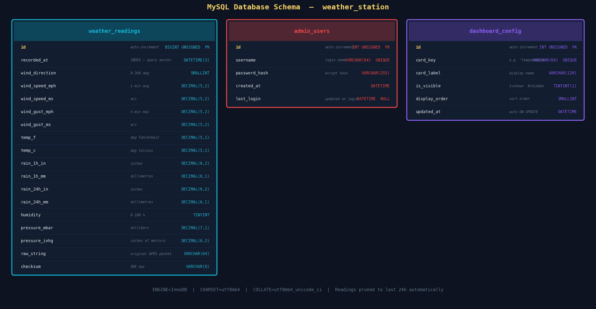

The MySQL database `weather_station` contains three tables.

#### `weather_readings`

The primary data store. Every reading from the weather station is persisted here.

```sql
CREATE TABLE weather_readings (
  id              BIGINT UNSIGNED AUTO_INCREMENT PRIMARY KEY,
  recorded_at     DATETIME(3)   NOT NULL DEFAULT CURRENT_TIMESTAMP(3),
  wind_direction  SMALLINT      NOT NULL,  -- 0–360 degrees
  wind_speed_mph  DECIMAL(5,2)  NOT NULL,  -- 1-min average
  wind_speed_ms   DECIMAL(5,2)  NOT NULL,
  wind_gust_mph   DECIMAL(5,2)  NOT NULL,  -- 5-min max
  wind_gust_ms    DECIMAL(5,2)  NOT NULL,
  temp_f          DECIMAL(5,1)  NOT NULL,
  temp_c          DECIMAL(5,1)  NOT NULL,
  rain_1h_in      DECIMAL(6,2)  NOT NULL,
  rain_1h_mm      DECIMAL(6,1)  NOT NULL,
  rain_24h_in     DECIMAL(6,2)  NOT NULL,
  rain_24h_mm     DECIMAL(6,1)  NOT NULL,
  humidity        TINYINT       NOT NULL,  -- 0–100 %
  pressure_mbar   DECIMAL(7,1)  NOT NULL,
  pressure_inhg   DECIMAL(6,2)  NOT NULL,
  raw_string      VARCHAR(64)   NOT NULL,  -- original APRS packet
  checksum        VARCHAR(8)    NOT NULL,
  INDEX idx_recorded_at (recorded_at)
) ENGINE=InnoDB;
```

Key design choices:
- **`BIGINT UNSIGNED`** for the primary key - the station produces ~86,400 readings per day. Even with 24h pruning active, a 32-bit integer would be exhausted in ~50 days of continuous operation without pruning.
- **`DATETIME(3)`** - millisecond precision timestamps. The `(3)` suffix allocates 3 fractional second digits. This allows tracking the exact sub-second arrival time of each reading.
- **`DECIMAL` for all measurement fields** - `FLOAT` and `DOUBLE` suffer from binary floating-point representation errors (e.g. `0.1 + 0.2 ≠ 0.3`). `DECIMAL` stores exact fixed-point decimal values, ensuring `24.4°C` is stored and retrieved as exactly `24.4`, not `24.39999999` or `24.40000001`.
- **`raw_string VARCHAR(64)`** - the original APRS packet is stored verbatim for debugging. If the parser ever has a bug, the raw data is still available to re-parse.
- **`INDEX idx_recorded_at`** - all queries are ordered by `recorded_at DESC`. Without this index, a `SELECT ... ORDER BY recorded_at DESC LIMIT 50` would require a full table scan.

#### `admin_users`

```sql
CREATE TABLE admin_users (
  id            INT UNSIGNED AUTO_INCREMENT PRIMARY KEY,
  username      VARCHAR(64)  NOT NULL UNIQUE,
  password_hash VARCHAR(255) NOT NULL,  -- bcrypt hash (never plain text)
  created_at    DATETIME     NOT NULL DEFAULT CURRENT_TIMESTAMP,
  last_login    DATETIME     NULL
) ENGINE=InnoDB;
```

Passwords are stored as bcrypt hashes with cost factor 12. The `last_login` field is updated on every successful login via:
```typescript
await prisma.adminUser.update({
  where: { id: user.id },
  data: { lastLogin: new Date() },
})
```

#### `dashboard_config`

```sql
CREATE TABLE dashboard_config (
  id           INT UNSIGNED AUTO_INCREMENT PRIMARY KEY,
  card_key     VARCHAR(64)  NOT NULL UNIQUE,  -- e.g. "temperature"
  card_label   VARCHAR(128) NOT NULL,         -- "Temperature"
  is_visible   TINYINT(1)   NOT NULL DEFAULT 1,
  display_order SMALLINT    NOT NULL DEFAULT 0,
  updated_at   DATETIME     NOT NULL DEFAULT CURRENT_TIMESTAMP
                            ON UPDATE CURRENT_TIMESTAMP
) ENGINE=InnoDB;
```

The default seed data creates config rows for: `temperature`, `humidity`, `wind_direction`, `wind_speed`, `wind_gust`, `pressure`, `rain_1h`, `rain_24h`. Each card's visibility is controlled by the admin panel toggle switches.

---

### 8.7 Authentication & Admin Panel

The admin panel (`/admin`) is protected by **NextAuth v5** using a JWT session strategy.

**Authentication flow:**
1. Browser navigates to `/admin`
2. `proxy.ts` middleware (Next.js middleware API) intercepts the request, checks for a valid JWT session token in the cookie
3. If no valid session: redirect to `/admin/login`
4. Login form submits username + password to the NextAuth credentials handler
5. NextAuth calls `authorize()` which queries MySQL for the user, verifies the bcrypt hash
6. If valid: NextAuth creates a signed JWT, sets it as an HTTP-only cookie
7. Subsequent requests to `/admin/*` pass the middleware check

```typescript
// auth.ts
async authorize(credentials) {
  const user = await prisma.adminUser.findUnique({
    where: { username: credentials.username as string },
  })
  if (!user) return null
  const valid = await bcrypt.compare(credentials.password, user.passwordHash)
  if (!valid) return null
  // Update last_login timestamp
  await prisma.adminUser.update({
    where: { id: user.id },
    data: { lastLogin: new Date() },
  })
  return { id: String(user.id), name: user.username }
}
```

**bcrypt cost factor:** The seed SQL uses `$2b$12$...` - cost factor 12. This means the bcrypt hash computation takes approximately 300ms on modern hardware, making brute-force attacks computationally prohibitive even if the password hash database were leaked.

**Admin panel features:**
- Toggle switches for each dashboard card (show/hide)
- `Save Changes` button with loading state and success confirmation
- System info display (serial port path, baud rate, sensor model, MCU)
- Sign Out button (clears JWT session cookie)

---

### 8.8 External APIs

#### Open-Meteo (7-day Forecast)

Open-Meteo is a free, open-source weather API that does not require API keys for reasonable usage. The dashboard fetches:

```
https://api.open-meteo.com/v1/forecast
  ?latitude={lat}
  &longitude={lon}
  &current=weather_code
  &daily=weather_code,temperature_2m_max
  &timezone=auto
```

- `current.weather_code` - WMO weather interpretation code for the current hour (used to set the hero icon in the main view)
- `daily.weather_code` - Per-day WMO code for the 7-day strip
- `daily.temperature_2m_max` - Daily maximum temperature at 2m height

**WMO code → icon mapping:**

| WMO Code | Condition | Icon |
|----------|-----------|------|
| 0 | Clear sky | ForecastSunnyIcon |
| 1 | Mainly clear | ForecastSunnyIcon |
| 2 | Partly cloudy | ForecastSunnyCloudyIcon |
| 3 | Overcast | ForecastCloudyIcon |
| 45, 48 | Fog | ForecastCloudyIcon |
| 51–67 | Drizzle / Rain | ForecastRainyIcon |
| 71–77 | Snow | ForecastSnowingIcon |
| 80–82 | Rain showers | ForecastRainyIcon |
| 95–99 | Thunderstorm | ForecastStormIcon |

#### BigDataCloud Reverse Geocode

```
https://api.bigdatacloud.net/data/reverse-geocode-client
  ?latitude={lat}&longitude={lon}&localityLanguage=en
```

Used to display the human-readable city name (e.g. "Burgas") in the hero section. Falls back to "Burgas" if the API fails or geolocation is denied. No API key required for this endpoint.

#### Browser Geolocation API

The dashboard requests the browser's GPS coordinates on load using `navigator.geolocation.getCurrentPosition()`. If permission is granted, the forecast and city name are fetched for the user's actual location. If denied or unavailable, the system defaults to the VSCPI Burgas coordinates (`42.5048°N, 27.4626°E`).

#### OpenStreetMap (Map Tab)

An OpenStreetMap `iframe` embed shows the station location at:
```
Lat: 42.456417, Lng: 27.401583
```
(ПГКПИ school campus, Burgas)

A CSS filter `invert(90%) hue-rotate(180deg) brightness(0.85) saturate(0.8)` transforms the standard light-coloured map tiles into a dark theme that matches the dashboard's colour palette.

---

### 8.9 CSS / Glassmorphism Design System

The dashboard's visual language is **Glassmorphism** - a design trend characterised by translucent frosted glass surfaces, subtle borders, and layered depth. All cards use:

```css
.glass-card {
  background: rgba(255, 255, 255, 0.06);        /* 6% white tint */
  backdrop-filter: blur(24px) saturate(180%);    /* frosted glass blur */
  border: 1px solid rgba(255, 255, 255, 0.12);  /* subtle border */
  box-shadow:
    0 8px 32px rgba(0, 0, 0, 0.4),              /* drop shadow */
    inset 0 1px 0 rgba(255, 255, 255, 0.15),    /* top highlight */
    inset 0 -1px 0 rgba(0, 0, 0, 0.2);          /* bottom shadow */
}
```

The **top highlight** (`inset 0 1px 0 rgba(255,255,255,0.15)`) simulates the bright edge of a real glass panel where light enters from above - a key perceptual cue that makes the surface read as glass rather than flat.

The **Aurora animated background** uses three overlapping radial gradients (blue, purple, cyan) that slowly drift around the screen on 12s, 15s, and 18s keyframe animations - creating the illusion of light dancing behind the frosted glass panels.

The **SVG Liquid Glass filter** in `layout.tsx` uses an SVG `feTurbulence + feDisplacementMap` filter to slightly warp the edges of elements, reinforcing the glass-warp visual metaphor. The filter is defined globally in an invisible SVG and referenced via `filter: url(#liquid-glass)`.

**Colour palette:**
| Variable | Value | Usage |
|----------|-------|-------|
| `--bg-primary` | `#070d1a` | Page background |
| `--bg-secondary` | `#0d1629` | Card backgrounds |
| `--glass-bg` | `rgba(255,255,255,0.06)` | Glass card fill |
| `--accent-blue` | `#3b82f6` | ESP32, firmware |
| `--accent-cyan` | `#06b6d4` | Live data, sensors |
| `--accent-purple` | `#8b5cf6` | Next.js, UI |
| `--text-primary` | `rgba(255,255,255,0.95)` | Main text |
| `--text-muted` | `rgba(255,255,255,0.35)` | Labels, secondary |

---

## 9. iOS Mobile App

### 9.1 Overview & Tech Stack

In addition to the web dashboard, a native **iOS 26 SwiftUI** app was built that connects to the same Next.js backend and displays live weather data on iPhone. The app mirrors the web dashboard's design language - dark navy background, glassmorphism cards, EU metric units (km/h, °C, mbar) - and adds native mobile features like the iOS 26 floating Liquid Glass tab bar and SF Symbol animations.

| Technology | Role |
|-----------|------|
| **SwiftUI (iOS 26)** | Declarative UI framework |
| **`@Observable` macro** | Reactive state management (replaces ObservableObject) |
| **URLSession AsyncBytes** | Byte-by-byte SSE streaming (avoids Turbopack buffering stall) |
| **Swift Charts** | History line + area charts |
| **MapKit** | Satellite map with realistic 3D elevation |
| **Open-Meteo API** | 7-day forecast (same as web app) |

### 9.2 App Structure

```
vscpi-weather-mobile/
├── Models/
│   ├── WeatherData.swift        — APRS field struct + EU unit conversions
│   ├── ForecastDay.swift        — Open-Meteo daily forecast + WMO → SF Symbol map
│   └── HistoryReading.swift     — /api/readings Codable struct (handles Prisma Decimal strings)
├── Services/
│   ├── SSEClient.swift          — URLSession byte-by-byte SSE parser, auto-reconnect
│   ├── ForecastService.swift    — Open-Meteo + BigDataCloud reverse geocode
│   └── HistoryService.swift     — GET /api/readings with custom ISO8601 date decoder
├── ViewModels/
│   └── WeatherViewModel.swift   — @Observable, throttled UI updates (1/min)
├── Views/
│   ├── Live/LiveView.swift      — Hero temp, metrics grid, wind compass, trend sparkline
│   ├── History/HistoryView.swift— Swift Charts area+line chart, metric selector, data table
│   ├── Map/StationMapView.swift — Satellite MapKit view with live wind overlay
│   ├── Info/InfoView.swift      — Team, schools, sensor specs, connection status
│   └── Components/
│       ├── LiveBadgeView.swift  — Pulsing LIVE/OFFLINE capsule indicator
│       ├── WindCompassView.swift— Canvas-drawn compass with animated needle
│       ├── MetricCard.swift     — Reusable glassmorphism metric card
│       └── ForecastStripView.swift — Horizontal 7-day forecast strip
└── Theme.swift                  — Color palette + glassCard() ViewModifier
```

**4 tabs:**
- **Live** - real-time temperature, humidity, pressure, wind speed/gust, rain, compass, trend sparkline, 7-day forecast
- **History** - Swift Charts line chart with metric selector (Temp / Humidity / Wind / Pressure / Rain) + scrollable data table
- **Map** - satellite MapKit view centred on VSCPI Burgas with live wind speed and direction overlay
- **Info** - development team, partner schools, sensor specifications, live connection status

### 9.3 How It Connects to the Server

The app connects to the same Next.js server as the browser. For the iOS Simulator, the base URL is `http://localhost:3000`. For a physical iPhone, change `SSEClient.baseURL` to the Mac's LAN IP (e.g. `http://192.168.1.3:3000`).

**SSE streaming fix - byte-by-byte reading:**
Next.js Turbopack's development server buffers streaming responses, causing Swift's `AsyncLineSequence` to stall indefinitely (bytes arrive but lines never emit). The fix is to read `asyncBytes` one byte at a time and build lines manually - this bypasses the buffering entirely. `Accept-Encoding: identity` is also set to prevent gzip compression from introducing additional buffering.

**Prisma Decimal fix:**
The `/api/readings` endpoint returns Prisma `Decimal` fields as JSON strings (`"24.1"` not `24.1`). `HistoryReading` uses a custom `init(from:)` that tries `Double` first, then falls back to `String → Double` conversion.

**UI throttling:**
The ESP32 sends a reading every 5 seconds. Re-rendering the full SwiftUI view tree with spring animations 12 times per minute caused lag. The ViewModel throttles UI updates to once per minute (`updateInterval = 60s`) while keeping the SSE connection alive continuously so the LIVE badge stays green.

---

## 10. Data Flow - End to End

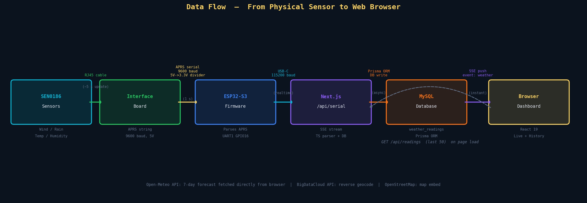

Here is the complete trace of a single weather reading from the moment wind pushes the anemometer cups to the moment a number updates on screen:

1. **Wind spins the anemometer** → reed switch closes → interface board counts pulses over 60 seconds → computes 1-minute average mph

2. **Interface board assembles APRS packet**: `c090s002g007t074r010p010h46b09960*30`

3. **Interface board transmits over UART**: each character sent at 9600 baud → ~1ms per byte → full 36-char packet in ~38ms → terminated with `\r\n`

4. **UART TX wire (5V) passes through R1** (10kΩ) **and R2** (20kΩ) **voltage divider** → GPIO 16 sees 3.33V logic HIGH/LOW transitions

5. **ESP32-S3 UART1 hardware peripheral** detects start bit, shifts in 8 bits per character, deposits characters into hardware FIFO

6. **`WeatherSerial.readStringUntil('\n')`** drains the FIFO into an Arduino `String` once the `\n` terminator arrives

7. **`WeatherParser::parse()`** extracts each field, converts units, sets status flags → returns a `WeatherData` struct

8. **`WeatherParser::printData()`** formats and prints the decorated box to `Serial` (USB-CDC)

9. **USB-CDC data** travels over the USB cable as USB bulk transfer packets at up to 12 Mbit/s (Full Speed)

10. **Host OS USB driver** exposes the data as `/dev/cu.usbmodemXXXX` - a standard POSIX character device

11. **`serialport` npm package** reads from the character device line-by-line via `ReadlineParser({ delimiter: '\r\n' })`

12. **TypeScript `parseWeatherString()`** strips the `[RAW]` prefix, re-parses the APRS string, returns a `WeatherData` TypeScript object with an ISO 8601 timestamp added

13. **`g._weatherListeners.forEach(cb => cb(weather))`** - the data is broadcast simultaneously to every connected SSE client

14. **Prisma `weatherReading.create()`** persists the reading to MySQL asynchronously (fire-and-forget, does not block SSE broadcast)

15. **Browser `EventSource`** receives the `event: weather` SSE frame, `JSON.parse(e.data)` unpacks it

16. **`setData(next)`** triggers a React re-render

17. **`useSpring` in `AnimatedNumber`** springs from the previous displayed value to the new value over ~1 second

18. **The temperature number on screen animates** - the reading has gone from physical wind → displayed pixel in approximately 2–3 seconds total.

---

## 10. Setup & Running the Project

### 10.1 Hardware Assembly

Follow Section 6.3 - Step-by-Step Assembly. Have the following ready:
- Fully assembled SEN0186 weather station with RJ45 cables plugged into interface board
- Voltage divider wired: Interface TX → R1(10kΩ) → GPIO16 → R2(20kΩ) → GND
- GND wire: Interface board GND → ESP32 GND
- 12V supply connected to interface board orange terminal (verify polarity)
- USB-C data cable connecting ESP32 bottom-left port to your computer

### 10.2 Firmware Setup (PlatformIO)

```bash
# Install PlatformIO CLI (if not using VSCode extension)
pip install platformio

# Navigate to firmware directory
cd SN0186-VSCPI-Firmware

# Install dependencies (ESP32-S3 Arduino core - first run takes several minutes)
pio pkg install

# Build
pio run

# Flash
pio run --target upload

# Monitor (verify sensor data is arriving)
pio device monitor
```

Expected serial monitor output after flashing:
```
=================================
ESP32-S3 Weather Station
=================================
UART1 RX: GPIO16
Baud rate: 9600
Expected: c000s000g000t086r000p000h53b10020*3E
Waiting for weather data...

[RAW] c090s000g003t076r000p010h42b09971*31

╔════════════════════════════════════════╗
║        WEATHER STATION DATA            ║
╠════════════════════════════════════════╣
║ Temperature:  76.0°F / 24.4°C
║ Humidity:     42%
║ Pressure:     997.1 mbar / 29.44 inHg
║ Wind Dir:     90° (E)
║ Wind Speed:   0.0 mph / 0.0 m/s
║ Wind Gust:    3.0 mph / 1.3 m/s
║ Rain (1h):    0.00" / 0.0 mm
║ Rain (24h):   0.10" / 2.5 mm
║ Checksum:     *31
╚════════════════════════════════════════╝
```

If you see this output, the firmware is working correctly. Close the serial monitor before starting the Next.js server (both cannot hold the serial port simultaneously).

### 10.3 Dashboard Setup (Next.js)

**Prerequisites:**
- Node.js 20+ and npm
- MySQL 8.x running locally or on a server
- The ESP32-S3 flashed and connected via USB-C

```bash
cd weather-dashboard

# Install dependencies
npm install

# Create the database and tables
mysql -u root < schema.sql

# Generate Prisma client
npx prisma generate

# Push schema to database (alternative to running schema.sql)
npx prisma db push

# Start the development server
npm run dev
```

The server starts on `http://localhost:3000`. Navigate there in your browser - the dashboard should show `LIVE` in the top-left and begin updating as soon as the ESP32 sends its first packet.

**For production deployment:**
```bash
npm run build
npm run start
```

### 10.4 Environment Variables

Create or edit `weather-dashboard/.env`:

```bash
# MySQL connection string
DATABASE_URL="mysql://root@127.0.0.1:3306/weather_station"

# NextAuth - must be a long random secret string in production
NEXTAUTH_SECRET="your-secret-here-change-this"

# NextAuth - the URL the app is served from
NEXTAUTH_URL="http://localhost:3000"

# Serial port (leave commented for auto-detection)
# SERIAL_PORT="/dev/cu.usbmodem1101"

# Serial baud rate - must match monitor_speed in platformio.ini
SERIAL_BAUD=115200
```

**`SERIAL_PORT` auto-detection** works by listing all serial ports and matching against manufacturer strings (Espressif) or USB path patterns (usbmodem, usbserial, CH340, CP210, FTDI). If auto-detection picks the wrong port, uncomment `SERIAL_PORT` and set it manually to the correct device path (check `ls /dev/cu.*` on macOS, or `ls /dev/ttyUSB*` on Linux).

**Default admin credentials:**
- Username: `admin`
- Password: `admin123`

**Change these immediately after first login** via the admin panel or by updating the `password_hash` in the `admin_users` table directly.

---

## 11. Troubleshooting

| Symptom | Most Likely Cause | Fix |
|---------|------------------|-----|
| No data in serial monitor | Wrong baud rate or wrong GPIO | Verify `WEATHER_BAUD=9600` and `WEATHER_RX_PIN=16` in `main.cpp` |
| Garbage/noise data | Baud rate mismatch | Try changing `WEATHER_BAUD` to `2400` - interface board jumper may be set to 2400 |
| ESP32 overheating or resetting | 5V applied directly to GPIO without divider | Add the 10kΩ+20kΩ voltage divider immediately |
| Temperature reads −17.8°C | Parser bug with signed temperature | Verify `extractInt(data, 13, 3)` - temperature field at index 13, length 3 |
| Wind speed always 0 | Old offset bug | Field `s` is at index 5 (not 4) - verify `extractInt(data, 5, 3)` |
| Rain shows 453 | Rain gauge not connected | Normal - `rainfallValid = false` is set correctly |
| Dashboard shows "Disconnected" | Serial port not found or busy | Check USB cable, close PlatformIO monitor, verify `SERIAL_PORT` env var |
| Port busy error in logs | PlatformIO monitor still open | Close `pio device monitor` before running `npm run dev` |
| No data in browser but port open | FireWall or SSE buffered by proxy | Add `X-Accel-Buffering: no` header; check for nginx proxy buffering |
| Admin redirects to login loop | `NEXTAUTH_SECRET` not set | Add `NEXTAUTH_SECRET` to `.env` |
| Prisma client not found | Forgot `npx prisma generate` | Run `npx prisma generate` after install |
| `Cannot find module 'serialport'` | Native module not built for Node version | Run `npm rebuild serialport` |
| Upload fails (ESP32) | ESP32 not in flash mode | Hold BOOT button, press RESET, release BOOT, then upload |

---


*Built with pride during the Erasmus+ student exchange between VSCPI Burgas, Bulgaria and Escola Secundária Dr. José Afonso (ESJA), Seixal, Portugal - February 2026.*
